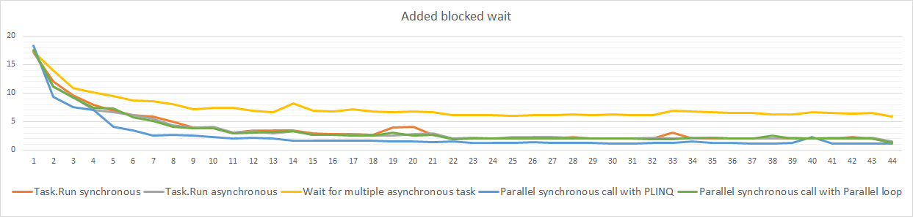

# cs-http
Downloads http resources and measure speed with different .NET approaches.  
All downloaded links are taken from [url.txt](url.txt) file.  
For each approach try to download with arbitrary degree of parallelism.  

## HttpTask class
[HttpTask.cs](HttpTask.cs) executes a get request.  
Have `synchronous` operation for download using `HttpWebRequest` .NET class.  
Have `asynchronous` analog for download using `HttpClient` .NET class.  
  
Operation have small cpu calculation at starting and ending and a lot of wait period for i/o task.

## Executer
[Executer.cs](Executer.cs) class provides different ways to run operation in parallel.  


## Results of running
Try this application:  
```
dotnet run
```
[MainVersion.cs](MainVersion.cs) runs the loop by methods and degree of parallelism.   
Outputs to console common information about measurement process.  
Creates two `.csv` file with results: 1) only downloads, 2) added pause before each download to simulate some work.  

  

By increasing the degree of parallelism of loading, the total processing time of all requests decreases.  
The dependence is not linear, too many simultaneous requests do not bring any benefits.  
The parallelization algorithm using PLINQ showed the best results.
Multiple asynchronous tasks is slower than other methods when there is a blocking wait.

[](https://hits.seeyoufarm.com)
